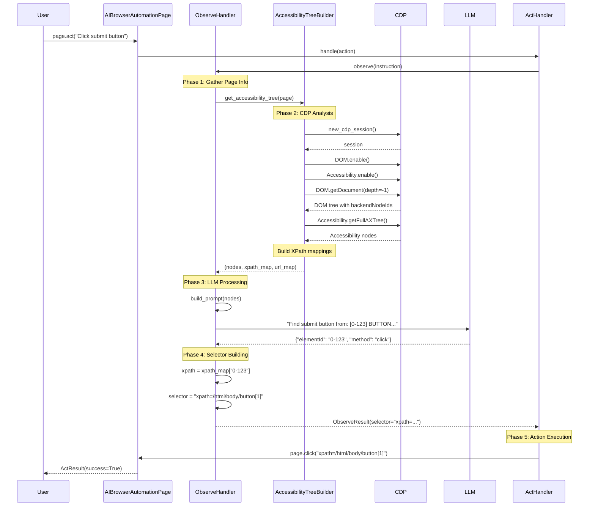

# CDP and XPath Workflow Diagram

## Visual Workflow



## Data Flow Diagram

```
┌─────────────────────────────────────────────────────────────────┐
│                         Input: "Click submit button"             │
└───────────────────────────────┬─────────────────────────────────┘
                                │
                                ▼
┌─────────────────────────────────────────────────────────────────┐
│                     1. CDP Session Creation                      │
├─────────────────────────────────────────────────────────────────┤
│  • await context.new_cdp_session(page)                          │
│  • Enable DOM and Accessibility domains                         │
└───────────────────────────────┬─────────────────────────────────┘
                                │
                                ▼
┌─────────────────────────────────────────────────────────────────┐
│                    2. Get DOM & A11y Trees                      │
├─────────────────────────────────────────────────────────────────┤
│  DOM Tree:                    │  Accessibility Tree:            │
│  {                           │  {                               │
│    nodeId: 1,                │    nodeId: "abc",               │
│    backendNodeId: 123,       │    backendDOMNodeId: 123,      │
│    nodeName: "button",       │    role: "button",              │
│    children: [...]           │    name: "Submit"               │
│  }                           │  }                               │
└───────────────────────────────┬─────────────────────────────────┘
                                │
                                ▼
┌─────────────────────────────────────────────────────────────────┐
│                    3. Build XPath Mappings                      │
├─────────────────────────────────────────────────────────────────┤
│  Traverse DOM tree:                                             │
│  • Calculate positions: button[1], div[2], etc.                │
│  • Build paths: /html[1]/body[1]/form[1]/button[1]            │
│  • Map: {123: "/html[1]/body[1]/form[1]/button[1]", ...}      │
└───────────────────────────────┬─────────────────────────────────┘
                                │
                                ▼
┌─────────────────────────────────────────────────────────────────┐
│                  4. Create Encoded Elements                     │
├─────────────────────────────────────────────────────────────────┤
│  For each accessibility node:                                   │
│  • encodedId = f"{frameOrdinal}-{backendDOMNodeId}"           │
│  • Example: "0-123" (main frame, node 123)                    │
│  • Include role, name, xpath in element data                   │
└───────────────────────────────┬─────────────────────────────────┘
                                │
                                ▼
┌─────────────────────────────────────────────────────────────────┐
│                      5. LLM Processing                          │
├─────────────────────────────────────────────────────────────────┤
│  Prompt:                      │  Response:                      │
│  "Find submit button in:      │  {                              │
│   [0-123] BUTTON: Submit      │    "elementId": "0-123",       │
│   [0-456] INPUT: Email        │    "method": "click",          │
│   [0-789] LINK: Cancel"       │    "arguments": []             │
│                               │  }                              │
└───────────────────────────────┬─────────────────────────────────┘
                                │
                                ▼
┌─────────────────────────────────────────────────────────────────┐
│                    6. Resolve to XPath                          │
├─────────────────────────────────────────────────────────────────┤
│  • elementId = "0-123"                                          │
│  • xpath = xpath_map["0-123"]                                  │
│  • selector = "xpath=/html[1]/body[1]/form[1]/button[1]"      │
└───────────────────────────────┬─────────────────────────────────┘
                                │
                                ▼
┌─────────────────────────────────────────────────────────────────┐
│                       7. Execute Action                         │
├─────────────────────────────────────────────────────────────────┤
│  await page.locator("xpath=/html[1]/body[1]/form[1]/button[1]")│
│            .click()                                             │
└─────────────────────────────────────────────────────────────────┘
```

## Key Data Structures

### 1. Encoded ID Format
```
encodedId = "{frameOrdinal}-{backendNodeId}"

Examples:
- "0-123"  → Main frame, node 123
- "1-456"  → First iframe, node 456
- "2-789"  → Second iframe, node 789
```

### 2. XPath Map Structure
```python
xpath_map = {
    "0-123": "/html[1]/body[1]/form[1]/button[1]",
    "0-456": "/html[1]/body[1]/form[1]/input[1]",
    "0-789": "/html[1]/body[1]/div[1]/a[1]",
    # ... hundreds more
}
```

### 3. Simplified Node Structure
```python
{
    "nodeId": 123,
    "encodedId": "0-123",
    "role": "button",
    "name": "Submit Form",
    "tagName": "button",
    "value": "",
    "description": ""
}
```

### 4. LLM Response Structure
```python
{
    "elementId": "0-123",      # The encoded ID
    "description": "Submit button for the form",
    "method": "click",         # Playwright method
    "arguments": []            # Method arguments
}
```

### 5. Final ObserveResult
```python
ObserveResult(
    selector="xpath=/html[1]/body[1]/form[1]/button[1]",
    description="Submit button for the form",
    encoded_id="0-123",
    attributes={"role": "button", "name": "Submit Form"},
    method="click",
    arguments=[]
)
```

## Error Handling Flow

```
┌─────────────────┐     ┌─────────────────┐     ┌─────────────────┐
│   Try CDP       │────▶│  CDP Fails?     │────▶│ Fallback to DOM │
│   Approach      │  No │                 │ Yes │   Scraping      │
└─────────────────┘     └─────────────────┘     └─────────────────┘
                               │
                               │ Success
                               ▼
                    ┌─────────────────────┐
                    │ Continue with XPath │
                    │    Processing       │
                    └─────────────────────┘
```